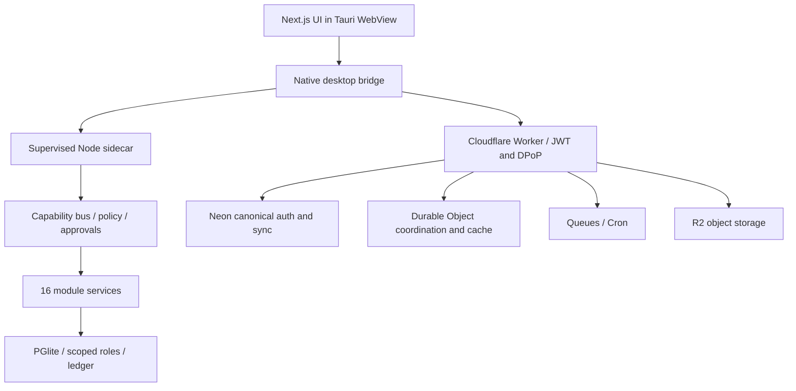

# XIO — Agent Harness

**One workspace to talk to agents, build projects, and operate your tools.**

XIO is a Windows-first agent operating system that brings project work, knowledge, business operations, and governed automation into one application. Its direction is a chat-first workspace: tell an agent what you need, inspect the proposed work, steer it while it runs, and keep the resulting evidence with the project.

**Private development repository · Windows x64 · Not release-certified**

Created and directed by Aaron. Developed with AI-assisted engineering tools. XIO is the product name; **XYRA** is its underlying development and intended operating process.

[Get started](docs/getting-started.md) · [Architecture](docs/architecture.md) · [Feature status](docs/product-status.md) · [Product direction](docs/product-direction.md) · [Development](CONTRIBUTING.md) · [Security](SECURITY.md)

> This repository contains the complete integrated source, not a finished implementation of every requested feature. The last verified product checkpoint is `148c6a2e150e0ffd5441c76611c48e91449dd84c`. The new universal chat, voice, themes, World, approval modes, and virtual-computer experience are being built. See the explicit status map below. An old installer must not be mistaken for the redesigned XIO release.

## What XIO brings together

- **Agents and work:** bounded execution, delegation, task queues, budgets, kill controls, and durable run records.
- **Projects and evidence:** specifications, approvals, dependencies, review drafts, schedules, and evidence-backed decisions.
- **Knowledge:** source-to-claim-to-fact lifecycles, retrieval, provenance, procedures, and erasure coordination.
- **Business tools:** operations, communications, growth, production, corporate administration, data, and intelligence modules.
- **Money:** integer-safe ledger operations and PAPER-only investment research and simulation.
- **Local-first desktop:** a Tauri shell, bundled Node sidecar, local PGlite store, typed capabilities, and Windows-native secret handling.
- **Cloud services:** Cloudflare authentication/sync/coordination and Neon canonical data, with R2-dependent workflows explicitly gated on storage readiness.

## The experience being built

```text
┌────────────────────────────────────────────────────────────────────┐
│ XIO    File  Edit  View  Window  Help            Theme   Settings   │
├──────────────┬──────────────────────────────────┬──────────────────┤
│ Chat         │ Agent / Model      Approval mode│ Current task     │
│ Projects     │                                  │ Plan & progress  │
│ World        │ Conversation, tool previews,     │ Changes          │
│ Library      │ outputs, and live task updates   │ Artifacts        │
│              │                                  │ Browser/computer │
│ Recent work  │ Message…       Voice       Send │ Activity         │
└──────────────┴──────────────────────────────────┴──────────────────┘
```

*Conceptual layout, not a screenshot or a claim of completed UI.*

Four overarching spaces keep domain tools accessible without requiring sixteen top-level tabs:

| Space | Purpose |
|---|---|
| **Chat** | Talk to agents, select configured models, preview tool actions, and steer active work. |
| **Projects** | Plans, tasks, editable requirements, progress, evidence, and contextual tools. |
| **World** | An original robotic/pixel-inspired view of actual agents, tasks, and workspaces; select an agent to inspect its work or open chat. |
| **Library** | Sources, files, memory, procedures, and created outputs. |

Models, connections, themes, and other preferences belong in Settings. Black/red is the requested primary theme, with selectable alternatives. Specialized module views remain accessible in context.

## Actual implementation status

| Area | Status at this repository's initial publication |
|---|---|
| All 16 module packages, migrations, generated registry | Integrated; registration does not mean every workflow is complete. |
| Desktop, local service, capability bus, scoped database, ledger | Implemented with integrated tests. |
| Native signal → durable PAPER decision → restart/replay | Tested with a synthetic local claim; not a live enrolled-device journey. |
| Development Cloud Worker and Neon migrations | Deployed/applied with scoped live checks; full authenticated product journeys still pending. |
| Windows installer | Earlier unsigned build passed install, launch, same-version reinstall, and uninstall. New UI installer is pending. |
| Universal chat, streaming voice, model UI, themes, consolidated spaces | In progress; not all are in the verified baseline. |
| Default product XYRA lifecycle, preview approval, scoped auto-approval | Requested runtime behavior; existing approval infrastructure is the foundation, not evidence of the complete new UX. |
| Agent browser, local and cloud virtual computers | Requested; backend selection, adapters, isolation and lifecycle verification remain. |
| Physical TPM, browser accessibility, genuine version upgrade | Not fully evidenced. |
| Full release certification | Pending. |

See [the detailed status and evidence](docs/product-status.md) for the boundaries of these claims.

## Sixteen modules, one harness

| Module | Responsibility |
|---|---|
| `core` | Workspace/platform foundations, auth and shared lifecycle data |
| `command` | Conversations, dashboards, plans, and orchestration entry points |
| `ops` | Operational projects and tasks |
| `comms` | Messages, inbox, meetings, and calendar workflows |
| `corporate` | Entities, resolutions, policies, organization, and compliance |
| `brain` | Retrieval, provenance, facts, memory, and procedures |
| `swarm` | Agent profiles, bounded runs, delegation, queues, and kill state |
| `forge` | Specifications, dependencies, approvals, review drafts, and evidence |
| `flow` | Durable workflows, steps, claims, checkpoints, and scheduling contracts |
| `connect` | Connector configuration and delegated credential workflows |
| `data` | Data-management workflows |
| `growth` | Contacts, sequences, content, funnels, ads, and relationships |
| `studio` | Production projects, scheduling, budgets, rights, and delivery |
| `intel` | Intelligence workflows |
| `money` | Ledger, balances, reconciliation, and financial records |
| `invest` | PAPER portfolios, risk controls, partial fills, tax lots, backtests, and reporting |

External adapters, selected write workflows, and cross-module journeys remain partial. Unavailable connectors must report that state instead of returning fabricated success.

## Architecture



The renderer is not the authority for credentials, trusted claims, workspace identity, or approval verification. The native process and sidecar enforce those boundaries. Module capabilities use typed contracts; database roles and row-level policies limit access. An envelope hash provides content binding, not authentication by itself.

## Quick start for development

Clone this private repository with an authorized GitHub account:

```powershell
git clone https://github.com/xcyclone8admin-exe/XIO-AGENT-HARNESS.git
Set-Location XIO-AGENT-HARNESS
npm.cmd ci
npm.cmd run verify
npm.cmd run build:web
```

Requirements include Node.js 22 or later and npm. Desktop development additionally needs current stable Rust/MSVC, Windows C++ Build Tools/SDK, WebView2, and Tauri CLI v2. The packaging script pins a checksum-verified Node runtime.

For the Windows installer build and native tests, follow [Getting started](docs/getting-started.md). A browser-only UI session does not automatically have the native desktop's authenticated local bridge.

## Repository layout

```text
apps/
  web/          Next.js static frontend
  desktop/      Rust/Tauri shell, native auth, runner, packaging
  sidecar/      Local API, capability bus, runtime integration
  cloud/        Cloudflare Worker, auth, sync, queues, blobs
modules/        Sixteen product domains
packages/       Contracts, SDK, UI, database, policy, agents, ledger
tools/          Registry generation, policy checks, Node staging
docs/           Architecture, setup, status, and product direction
```

## Configuration and safety

- Credentials, local databases and login sessions are **not** part of this repository.
- Restore credentials through secure native/broker or deployment mechanisms; never paste keys into agent conversations.
- Cloud migration-owner connections must remain separate from restricted runtime connections.
- The previous development deployment is not an invitation to reuse its account or make production changes.
- The product's new default is **Preview & approve**. Scoped automatic approval is an explicit product-user setting under development, distinct from permission granted to the team building XIO.
- Browser session isolation is not virtual-machine isolation. Local/cloud computer tools need verified backends and resource limits.
- Investment execution remains **PAPER-only**.

## Development evidence

At source checkpoint `148c6a2`:

- `npm run verify`: 430 tests across 64 files, workspace typechecks and lint; repository checks passed.
- Rust library tests with `cloud-dev`: 88 passed.
- Static web export: 66 pages.
- Desktop resource preparation and bundled sidecar smoke: passed.
- Unsigned installer install/launch/repeat-install/uninstall: passed on the build machine.

These counts describe a specific candidate, not every future commit or a clean-machine certification. Updated feature checkpoints need their own evidence.

## Roadmap and handoff

The next delivery must finish and verify the new XIO experience before the final ZIP: universal chat, voice, model selection, task steering, themes, World, native menus, preview/auto-approval, portable XYRA process, and agent browser/virtual-computer support. The handoff will contain a matching installer, full source, architecture and installation/development instructions. [Read the product direction](docs/product-direction.md).

## Provenance and rights

XIO adapts code from [FounderOS-DEMO](https://github.com/Bennettxai/FounderOS-DEMO) and [starnet](https://github.com/androoAGI/starnet), and draws requirements from [XIO-AGENT-OS](https://github.com/ocean824/XIO-AGENT-OS) and [XYRASYSTEMS—OMEGA-AI](https://github.com/ocean824/XYRASYSTEMS---OMEGA-AI). Original source repositories are preserved.

See [THIRD_PARTY_NOTICES.md](THIRD_PARTY_NOTICES.md) for code provenance and licenses. The starnet branding, station artwork and sprites are excluded. This private repository does not introduce a blanket open-source license for new XIO work; third-party components retain their own terms.
