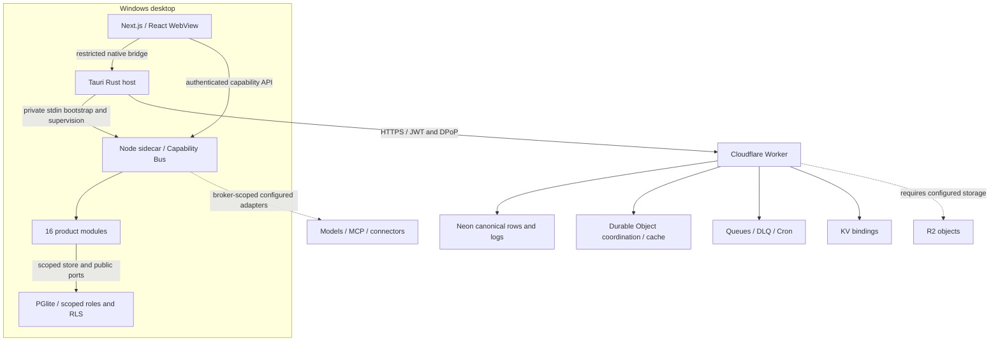
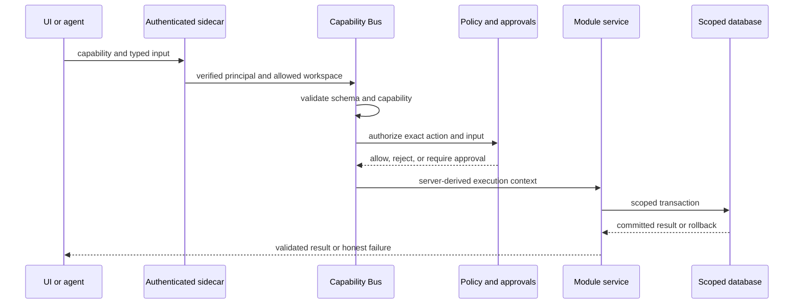

# XIO architecture

Standalone guide for integrated source through UI milestone `690e18a240078a5c4c266dc5d772e9daf93eadbf`. Earlier native/installer evidence belongs to `148c6a2`. This replaces the old pointer to documents outside the repository. Future work is labeled explicitly.

## Composition

XIO is a modular desktop application with a local backend and an optional authenticated cloud connection. Tauri hosts a statically exported Next.js frontend and supervises a bundled Node sidecar. The sidecar composes modules, capability handlers, and embedded PGlite. Cloudflare Workers provide authentication, sync and coordination against canonical Neon data.

Dashed edges have external configuration or integration prerequisites. They do not mean every provider or storage workflow is live. Local/cloud VM backends and the new internal agent browser are requested additions, not components of this checkpoint.

## Source map

| Location | Responsibility |
|---|---|
| `apps/web` | Static-export frontend, module pages, application composition |
| `apps/desktop` | Rust/Tauri commands, native auth and keys, sidecar supervisor, packaging |
| `apps/sidecar` | Local HTTP boundary, capability bus, trusted dependency injection, persistent services |
| `apps/cloud` | Worker routes, authentication, canonical sync, jobs, blob/erasure and signal protocols |
| `packages/contracts` | Shared strict schemas and cross-boundary types |
| `packages/core` | IDs, clocks, HLC, integer-safe values and logging primitives |
| `packages/db` | Database adapters, migrations, scoped access and privilege preparation |
| `packages/policy` | Authorization and policy decisions |
| `packages/agent-core` | Bounded runs, model routing, provider/MCP adapters, prepared-result contracts |
| `packages/ledger` | Double-entry posting, balances, transactional PAPER integration |
| `packages/sync` | Sync protocol, HLC merge and conflict behavior |
| `packages/sdk`, `packages/ui`, `packages/brand` | Frontend client, components and identity constants |
| `modules` | Vertical slices: schema, contracts, handlers, UI and tests |
| `tools` | Registry generation, repository checks and Node staging |

## Modules and host integration

The 16 module IDs are `core`, `command`, `ops`, `comms`, `corporate`, `brain`, `swarm`, `forge`, `flow`, `connect`, `data`, `growth`, `studio`, `intel`, `money`, and `invest`.

A module manifest declares tables, authority/sync classes, permissions, capabilities, navigation and dependencies. Migrations are ordered and additive. The registry generator discovers modules and emits registry/migration lists. Structural tests compare declarations with the migrated database.

The sidecar is the composition root. It supplies scoped repositories and server-only ports to services; some modules use factory registrars and some need explicit adapters. A module directory or generated page alone is not evidence of a working workflow. Check registration and real capability invocation.

Cross-module operations use public contracts and injected ports. A module must not import another module's private service or reach into protected platform tables. MONEY and INVEST share one injected ledger writer; the host supplies SWARM kill-state access and FLOW custody-step integration through defined interfaces.

## Local request and approval path

Approval proof is constructed by trusted code and bound to actor, tenant/workspace, capability and exact input. It is not a caller-supplied boolean. Consequential handler failures may happen after approval consumption; the interface must not falsely promise an approval remains reusable.

Universal previews and scoped auto-approval must use this boundary. The bus is a foundation, not proof those new controls already exist. Unsupported dry-runs must be labeled as proposals, without executing the action.

## Native authority and credentials

The native host launches the sidecar with a versioned private stdin bootstrap. Renderer launch authority and the separate native sync token are distinct. Native-only sync acknowledgements and INVEST signal consumption use fixed private routes; renderer-origin requests must not impersonate native callers.

Cloud transport is restricted to configured origins and routes. Credentials, refresh tokens and signing keys do not belong in frontend state, prompts, source or logs. Windows device signing uses CNG P-256; physical TPM proof remains separate from compilation and controlled tests. See [device-key implementation](../apps/desktop/docs/windows-cloud-device-key.md).

## Storage, tenancy and synchronization

Local PGlite and cloud Neon enforce scoped SQL access and RLS. Application roles cannot freely elevate to module write roles. Server write grants derive from explicit capability declarations. The platform role is not a blanket module writer.

The cloud runtime login is restricted and separate from the migration owner. The original dev environment's PostgreSQL 18 probes verified role restrictions, denied `SET ROLE`, tenant isolation, and disposable fixture cleanup. Repeat these checks for a different deployment: a clone does not inherit database configuration.

Neon is canonical for synced rows, per-field HLC metadata, sequences, conflicts, idempotency and cache outbox. Accepted mutations and related records commit atomically. Durable Objects provide coordination and replayable cache/realtime projection, not the sole durable relational source of truth. Workspace authority is rechecked for authenticated requests.

Object storage is separate from row sync. Row edges do not prove blob ownership or complete references. Cloud ingestion finalization binds authoritative content and object references to a versioned receipt. Erasure requires source/version binding, a durable purge claim, local transactional receipt/outbox, Cloud disposition and resurrection protection. Unknown references, holds or unavailable storage cannot be represented as completed deletion.

## Financial and agent execution boundaries

Ledger amounts use integer units and asset scales. Balanced postings, immutable entries and projection updates share a transaction. INVEST fills, FIFO lots and ledger changes share the PAPER transaction. Simulation, manually supplied prices and backtests must not be described as live trading or verified market data.

Agent runs are bounded by budgets, cancellation, deadlines and lease fencing. Prepared runs and review receipts bind identity and exact input/output digests. A hash detects a changed payload; it does not authenticate its producer. Trusted transport and principal checks are required too.

FORGE review drafts remain awaiting human validation; persistence does not turn them into independent decisions. Host preparation/result delivery, scheduled providers and complete end-to-end evidence remain on the delivery ledger.

Privileged process execution stays closed until actual isolation, verifier and watchdog controls are available and tested. A browser context is not a VM, and Docker/WSL presence is not an implemented XIO computer backend.

## Build and evolution

Next.js exports static pages. Packaging stages a checksum-pinned Node executable, bundled sidecar, runtime dependencies and notices into NSIS. Source, installer and checksums must refer to the same handoff candidate.

The shell now consolidates navigation into Chat, Projects, World and Library while retaining module access. Conversations persist through Command capabilities; project and Library views read scoped services. Themes persist on the device. World renders module dependencies. General chat-to-agent execution is still unconnected. Menus, voice, portable XYRA enforcement, durable preview policies and local/cloud computers remain in [product direction](product-direction.md). Update status from implementation and runtime evidence, not this diagram.
